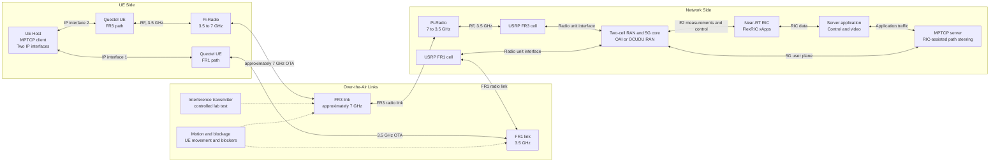
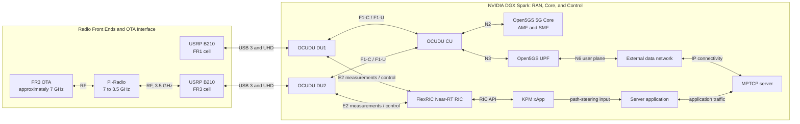

# Falcomm

Falcomm is a 5G/AI-RAN experimental platform based on the NVIDIA DGX Spark. **One private 5G SA link carried application traffic on 2026-10-05; OCUDU DU1 connected to FlexRIC and delivered actual UE KPM reports to the C xApp on 2026-10-07.** Two Open Cells SIMs have now been provisioned and verified in Quectel modems, including SIM2 in a second physical modem. Their Open5GS subscriber preparation and dual-DU end-to-end registration remain pending. The longer-term objective is dual independent radio paths with FlexRIC telemetry, AI channel/rate prediction, and MPTCP video steering.

**Start here: [Full Reproduction Runbook](docs/full_reproduction_runbook.md)** — restart the installed Spark infrastructure, configure the RMU500EK/RM500Q on a new Ubuntu laptop, register, establish IPv4 data, configure WWAN, test local traffic and shut down. [Troubleshooting and the 2026-10-05 debug record](docs/troubleshooting/2026-10-05_sa_bringup.md) explain the repaired failures.

For daily operation, use the command booklets: **[Spark quick commands](docs/spark_quick_commands.md)** and **[UE laptop quick commands](docs/ue_laptop_quick_commands.md)**. They show compact confirmations; the full runbook retains detailed diagnostics. The [2026-10-07 FlexRIC record](docs/troubleshooting/2026-10-07_flexric_bringup.md) records the codec/version repair, successful subscription and actual UE measurements.

For the new cards, follow [SIM Provisioning and Dual-UE Preparation](docs/sim_provisioning_and_dual_ue.md): reader setup, personalization, authentication checks, modem verification, and the remaining Open5GS/dual-link work.

## Verified Single-Link Architecture

```text
Linux laptop application ↔ WWAN ↔ RMU500EK / RM500Q-GL
    ↔ NR SA n78 ↔ B210 (3271233) ↔ OCUDU DU1
    ↔ F1 ↔ OCUDU CU ↔ N3 ↔ Open5GS UPF ↔ ogstun ↔ Spark application
```

CU-to-AMF N2 carries access signalling; SMF controls the UPF over N4/PFCP. The tested application endpoints are Spark `10.45.0.1` and the current UE allocation in `10.45.0.0/16`. Management Wi-Fi is separate. The local experiment does not require Internet NAT or changing the laptop's Wi-Fi default route.

The verified telemetry connection is `OCUDU DU1 ↔ E2 ↔ FlexRIC ↔ KPM xApp`. E2 Setup, KPM subscription, actual gNB-DU UE reports and subscription deletion passed.

## Target Architecture

The next deployment uses two separate UEs/subscribers on the same laptop, each with its own SIM, modem, and intended DU path:

```text
OC011830 / IMSI 001010000000101 → Quectel #1 → DU1 ─┐
                                                  ├→ shared CU → Open5GS / UPF
OC011831 / IMSI 001010000000102 → Quectel #2 → DU2 ─┘

UE laptop: two independent WWAN interfaces / IP paths → later MPTCP
```

Both cards use PLMN `00101`, but have independent K/OPc pairs. The shared PLMN does not force SIM1 onto DU1 or SIM2 onto DU2; cell selection and the observed serving cell must establish that intended association. The two-modem/two-DU RAN and independent IP paths have not yet been validated. MPTCP will combine transport paths after both UEs have working PDU sessions; it does not merge their RAN/core subscriber identities. The FR1/FR3 research design below remains the longer-term target.



The future FR1/FR3 diagram uses nominal 3.5 GHz equipment interfaces and an approximately 7 GHz converted OTA path. The verified single-link radio operates at **3.75 GHz**. Pi-Radio frequency conversion, the second path and MPTCP steering remain future work. FlexRIC and its KPM xApp receive actual UE measurements from DU1. The working RAN is OCUDU with Open5GS; the OAI label in the concept diagram is an alternative implementation, not part of the current deployment.

### Network-Side Implementation: OCUDU, Open5GS, and FlexRIC

The following diagram expands the planned network-side implementation on the DGX Spark. The FR1 and FR3 radio branches terminate at separate OCUDU DUs. The FR3 Pi-Radio unit downconverts the approximately 7 GHz OTA signal to the 3.5 GHz interface used by the network-side radio chain.



In the target system, E2 carries DU/RAN measurements to FlexRIC, and the xApp provides path-steering input to the server application and MPTCP controller. The diagram describes the future two-path implementation. The single-DU chain has now been verified through SA registration, IPv4 PDU setup and initial application traffic, as described below.

DU1's E2 connection and actual UE KPM collection are also verified. DU2 and the path-steering connections in this diagram remain pending.

## Current Status

The reported **2026-10-05** session verified private SSB detection, PRACH/PUSCH with CRC OK and strong uplink SINR, SA registration/authentication, attached packet service, IPv4 PDU/IP allocation, a connected bearer and manually configured WWAN. The first 10-second TCP uplink test reported **6.29 Mbit/s sender, 5.09 Mbit/s receiver, 0 sender retransmissions**. This is a functional user-plane result; throughput and sustained realtime operation are not yet characterized.

Confirmed repairs were NRF serving PLMN `999/70` → `001/01`, provisioning the missing subscriber, reliable NR/SA private-cell selection, subscriber session type 3 (IPv4v6) → type 1 (IPv4) after OCUDU rejection, host performance tuning, and static WWAN configuration. RX gain 40 was validated by successful uplink access. See [Project Progress](docs/project_progress_and_configuration.md) and the [chronological debug record](docs/troubleshooting/2026-10-05_sa_bringup.md).

On **2026-10-07**, FlexRIC `73650812` registered DU1 and the C xApp subscribed to RAN function ID 2, received all five DU metrics for actual gNB-DU UE ID `14`, then deleted the subscription and exited normally. Selected samples show RLC-derived uplink throughput of **14.163–14.675 Mbit/s** and UL PRB usage of **86%**. These are KPM measurements; a new synchronized application throughput benchmark was not recorded. The earlier pinned `1a3903a7` used a modified KPM ASN.1 codec that failed to decode in OCUDU for Format 4. Updating FlexRIC corrected the subscription failure. See the [FlexRIC bring-up record](docs/troubleshooting/2026-10-07_flexric_bringup.md) for units and the invalid indication-latency display.

After installing the [timestamp repair](docs/troubleshooting/2026-10-07_flexric_latency_fix.md), a later actual UE ID `2` run produced **12 `report_age_us` values from 499 to 717 microseconds**, with normal subscription deletion and exit. Selected UL RLC throughput samples were **11.916–11.927 Mbit/s**, with UL PRB usage **88%**. The repaired display measures age relative to the decoded report timestamp, including processing and queueing; it does not establish pure transport latency or application goodput.

Open Cells **OC011830** now holds IMSI `001010000000101` / `OpenCells101`; **OC011831** holds IMSI `001010000000102` / `OpenCells102`. Both passed Milenage authentication at programmer SQN **64**, with a reported HSS reference SQN **96**, and both Quectel USIM applications were ready. SIM2 was also verified in the second physical RM500QGL_VH, IMEI `863305041980706`; the first unit's previously observed IMEI was `863305041978437`. These are SIM/UICC checks, not successful private-network registration. The verified single-link subscriber remains IMSI `001010000000001`.

Authentication secrets stay in local permission-600 files `~/sim_du1_credentials.txt` and `~/sim_du2_credentials.txt`, outside Git. Next, create or verify the two matching Open5GS subscriber records with SST 1, DNN `internet`, and IPv4 session type 1, checking Open5GS SQN representation before using the programmer's reference value. Then deploy CU + DU1 + DU2, verify each UE's intended cell and registration, establish separate PDU/WWAN/IP paths, and test MPTCP. Extend the already verified DU1 FlexRIC telemetry to per-DU/per-UE monitoring after dual-link reception works.

## Platform and Software Versions

| Component | Recorded configuration |
|---|---|
| Host | NVIDIA DGX Spark, aarch64, Ubuntu 24.04.5 LTS |
| Kernel | NVIDIA `7.0.0-1019-nvidia`, `PREEMPT_DYNAMIC` |
| OCUDU | `release_26_04`, commit `050a2bb`, built with Clang 18 |
| FlexRIC | `br-flexric`, pinned `73650812`; GCC 13.3, Debug, E2AP v3 / KPM v3.00, C xApp, no xApp DB |
| Open5GS | `2.8.0~noble5` |
| MongoDB | Docker image `mongo:7.0-jammy` (arm64) |
| Radio interface | Ettus B210 #1, UHD `4.6.0.0`; ZeroMQ is not used in the current deployment |
| Radio settings | n78, carrier ARFCN 650000 / 3750 MHz, SSB ARFCN 649632, 20 MHz, 30 kHz; 2026-10-05 traffic used TX 80 / RX 40; 2026-10-07 inspected file has TX 70 / RX 40 |
| UE | RMU500EK / RM500QGL_VH, firmware `RM500QGLABR13A03M4G` |
| Private session | PLMN `00101`, TAC 7, SST 1, DNN `internet`, IPv4 only |
| MPTCP | Supported by the NVIDIA kernel; `net.mptcp.enabled = 1` |

Versions and runtime results above are drawn from the deployment records. FlexRIC and the C KPM xApp receive actual UE telemetry; the AI control path and active steering remain pending.

## Document Index

```text
README.md
docs/
├── project_progress_and_configuration.md
├── software_installation_and_drivers.md
├── sim_provisioning_and_dual_ue.md
├── full_reproduction_runbook.md
├── spark_quick_commands.md
├── ue_laptop_quick_commands.md
├── development_handoff.md
└── troubleshooting/
    ├── 2026-10-05_sa_bringup.md
    ├── 2026-10-07_flexric_bringup.md
    └── 2026-10-07_flexric_latency_fix.md
```

| Document | Purpose |
|---|---|
| [Project Progress and System Configuration](docs/project_progress_and_configuration.md) | Verified architecture, phase status, configuration values and remaining work |
| [Software Installation, Drivers, and OCUDU Environment](docs/software_installation_and_drivers.md) | Software dependencies, drivers, compiler/build environment and installation issues |
| [SIM Provisioning and Dual-UE Preparation](docs/sim_provisioning_and_dual_ue.md) | Open Cells card programming, protected credentials, Quectel checks, and remaining dual-subscriber/dual-DU validation |
| [Full Reproduction Runbook](docs/full_reproduction_runbook.md) | Startup, laptop setup, registration, IPv4 data, traffic and shutdown commands |
| [Spark quick commands](docs/spark_quick_commands.md) | Command booklet for core, CU, FlexRIC, DU, xApp, traffic and shutdown with compact checks |
| [UE laptop quick commands](docs/ue_laptop_quick_commands.md) | Command booklet for modem selection, SA registration, IPv4 bearer, WWAN and traffic |
| [5G SA Bring-up Debug Record, 2026-10-05](docs/troubleshooting/2026-10-05_sa_bringup.md) | Dated evidence, confirmed repairs and troubleshooting decision tree/matrix |
| [FlexRIC Bring-up Record, 2026-10-07](docs/troubleshooting/2026-10-07_flexric_bringup.md) | Version/codec repair, E2/KPM lifecycle and actual UE metrics |
| [FlexRIC Timestamp Repair, 2026-10-07](docs/troubleshooting/2026-10-07_flexric_latency_fix.md) | Tested timestamp patch, deployment command and report-age semantics |
| [Development Handoff](docs/development_handoff.md) | Working constraints and next steps for continued development |

New members should read the project overview and configuration first, prepare missing software using the installation guide, then follow the runbook. Consult the dated debug record when a stage fails and the handoff document before extending the system. The quick command booklets summarize the canonical runbook for each host; future experiment records use `docs/troubleshooting/YYYY-MM-DD_topic.md`.

## Quick Start

The following reproduces the existing single-link subscriber `001010000000001`. For the new `...101` / `...102` cards, complete the matching subscriber records and dual-UE preparation in the [SIM guide](docs/sim_provisioning_and_dual_ue.md) first. Follow the [Full Reproduction Runbook](docs/full_reproduction_runbook.md) one stage at a time:

1. Check B210/USB 3 while DU is stopped; apply and verify the recorded OCUDU performance settings.
2. Start/check MongoDB, verify the exact subscriber is IPv4-only, and align NRF/AMF PLMN.
3. Start the ten required SA services and verify AMF/PFCP/ogstun.
4. Launch CU with `sudo` and FlexRIC in separate foreground terminals, then launch DU with the base and E2 overlay configs; verify N2, F1, GTP-U and E2.
5. Configure the laptop modem for NR SA/private SSB, establish IPv4 data, and apply the actual active bearer's host settings.
6. Test local private traffic and record RF-error growth. Run the 10-second KPM xApp during UE traffic to validate actual reports.
7. Stop traffic/xApp and the laptop PDU first, then DU, FlexRIC, CU and core.

Before operation, verify that local configuration files and device state match the [Full Reproduction Runbook](docs/full_reproduction_runbook.md). The current DU configuration transmits at approximately **3.75 GHz**. Operate only at an authorized frequency, location, and power level. Do not run UHD probes or benchmarks that access the B210 while the DU is using it.

The current Falcomm over-the-air chain uses **UHD and a USRP B210**. ZeroMQ settings in upstream RIC tutorials describe a software-radio example and are not part of this deployment. FlexRIC validation should enable E2 on the existing UHD/DU configuration.

## Scope and Limitations

- The verified configuration covers one DU, one B210 and one RM500Q with an initial IPv4 TCP uplink result. Cold-start/new-laptop reproduction, longer uplink, downlink, UDP loss/jitter and video are still validation tasks.
- Two new SIMs and modem UICC checks are complete; new-subscriber registration, DU2 deployment, two simultaneous WWAN/IP paths and MPTCP remain pending.
- FlexRIC E2 Setup, actual UE KPM values, the repaired report-age display and subscription/deletion are verified. Correlation with synchronized application traffic, precise timing accuracy and sustained stability remain validation tasks.
- The 30.72 MS/s, 20-s UHD benchmark is a radio/USB stress test. The current OCUDU configuration uses a 23.04 MS/s sample rate.
- The NVIDIA kernel, PREEMPT_RT status, and system-default GCC configuration are retained to preserve the reproducible baseline.
- `ocudu_performance` and privileged RAN launch were applied. Recurring RF failures improved; long-duration stability is still open.
- Runtime modem/bearer/AT/QMI/WWAN identifiers and UE IPv4 can change. Query them rather than reusing example IDs or addresses.
- SIM authentication secrets, authentication vectors and derived RAN keys must remain outside Git. INFO logs require sanitization before sharing.
