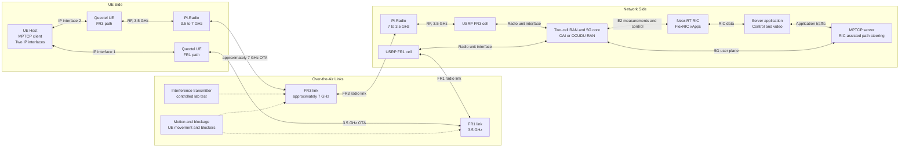
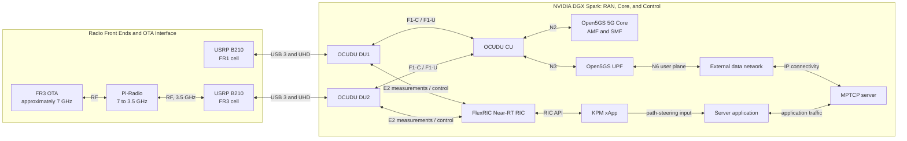

# Falcomm

Falcomm is a 5G/AI-RAN experimental platform based on the NVIDIA DGX Spark. The project combines a dual-path UE setup, two over-the-air radio links, a two-cell RAN and 5G core, FlexRIC, and an MPTCP server to study path steering using RAN measurements. The present implementation baseline uses OCUDU and Open5GS; the target architecture also allows an OAI-based RAN.

## Target Architecture



The FR1 path operates over the air at 3.5 GHz. For the FR3 path, Pi-Radio units upconvert the UE-side 3.5 GHz signal to approximately 7 GHz for the OTA link and downconvert it at the network side. FlexRIC xApps use RAN measurements to inform MPTCP path steering. The current verified radio configuration remains a single OCUDU DU and B210 operating at 3.75 GHz; the two-path topology shown here is the project target, not a completed deployment.

### Network-Side Implementation: OCUDU, Open5GS, and FlexRIC

The following diagram expands the planned network-side implementation on the DGX Spark. The FR1 and FR3 radio branches terminate at separate OCUDU DUs. The FR3 Pi-Radio unit downconverts the approximately 7 GHz OTA signal to the 3.5 GHz interface used by the network-side radio chain.



In the target system, E2 carries RAN measurements to FlexRIC, and the xApp provides path-steering input to the server application. The application coordinates with the MPTCP server, which exchanges user traffic with the UE through the 5G core. This is a target design; only the single-DU N2/F1 connectivity described in the current-status section has been verified.

## Current Status

As of **2026-10-02**, the DGX Spark baseline, UHD/B210 #1, OCUDU build, and basic connectivity among one CU, one DU, and Open5GS have been verified. N2 (CU-to-AMF) and F1 (CU-to-DU) associations have been established, and DU1 has operated B210 #1 through UHD.

The currently verified topology is:

```text
MongoDB 7 (Docker) → Open5GS → OCUDU CU → OCUDU DU1 → UHD → USRP B210 #1
```

UE subscriber provisioning and attachment, the second DU/B210, real-time tuning, FlexRIC/xApp, dual-path MPTCP, and AI-based proactive path selection remain future work. See [Project Progress](01_project_progress.md) for phase-level status.

## Platform and Software Versions

| Component | Recorded configuration |
|---|---|
| Host | NVIDIA DGX Spark, aarch64, Ubuntu 24.04.5 LTS |
| Kernel | NVIDIA `7.0.0-1019-nvidia`, `PREEMPT_DYNAMIC` |
| OCUDU | `release_26_04`, commit `050a2bb`, built with Clang 18 |
| Open5GS | `2.8.0~noble5` |
| MongoDB | Docker image `mongo:7.0-jammy` (arm64) |
| Radio interface | Ettus B210 #1, UHD `4.6.0.0`; ZeroMQ is not used in the current deployment |
| MPTCP | Supported by the NVIDIA kernel; `net.mptcp.enabled = 1` |

Versions and runtime results above are drawn from the deployment records. FlexRIC, the xApp, and the AI control path have not yet been deployed.

## Document Index

- [Project Progress and System Configuration](01_project_progress.md): target architecture, phase status, software versions, and CU/DU and Open5GS configuration records.
- [Operational Command Reference](02_operation_commands.md): service startup and shutdown, CU/DU launch, link checks, and routine operations.
- [Reproducible Installation Procedure](03_reproducible_installation_steps.md): steps to reproduce the completed deployment on a clean DGX Spark system.
- [Development Handoff](04_codex_handoff_prompt.md): environment constraints, known status, and working procedures for continued development.

## Quick Start

The full startup sequence and verification commands are provided in the [Operational Command Reference](02_operation_commands.md). The high-level sequence is:

1. Start the MongoDB Docker container and Open5GS services.
2. Start the CU from `~/ocudu`: `build/apps/cu/ocu -c configs/cu.yml`.
3. Verify B210 availability, then start the DU: `build/apps/du_split_8/odu -c configs/du1_b210_n78_20mhz.yml`.
4. Check AMF N2, CU/DU F1-C connectivity, and DU/UHD logs.

Before operation, verify that local configuration files and device state match the [Operational Command Reference](02_operation_commands.md). The current DU configuration transmits at approximately **3.75 GHz**. Operate only at an authorized frequency, location, and power level. Do not run UHD probes or benchmarks that access the B210 while the DU is using it.

The current Falcomm over-the-air chain uses **UHD and a USRP B210**. ZeroMQ settings in upstream RIC tutorials describe a software-radio example and are not part of this deployment. FlexRIC validation should enable E2 on the existing UHD/DU configuration.

## Scope and Limitations

- The verified configuration covers one DU and one B210; UE registration and end-to-end data service have not been demonstrated.
- The 30.72 MS/s, 20-s UHD benchmark is a radio/USB stress test. The current OCUDU configuration uses a 23.04 MS/s sample rate.
- The NVIDIA kernel, PREEMPT_RT status, and system-default GCC configuration are retained to preserve the reproducible baseline.
