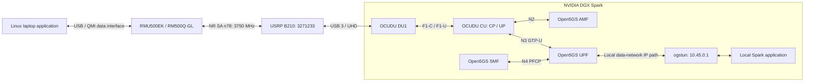

# Project Progress and System Configuration

Last updated: **2026-10-05**. The end-to-end results below are from the operator's reported experiment. Local CU/DU, NRF, AMF, SMF and UPF files were also inspected during this documentation update. A new cold-start/end-to-end run was not performed as part of the update.

## Current verified single-link architecture



The tested application path is **laptop ↔ Spark over private 5G**. Management Wi-Fi (observed Spark address `10.20.44.26` on `wlP9s9`) is separate. Public Internet connectivity, NAT and a replacement laptop default route are outside this baseline. The broader two-path FR1/FR3, FlexRIC, AI and MPTCP design remains in the [README target architecture](../README.md#target-architecture).

## Phase status

| Phase | Scope | Status on 2026-10-05 |
|---|---|---|
| 0 | DGX Spark baseline | Verified |
| 1 | UHD / B210 #1 / USB 3 | Verified |
| 2 | OCUDU build | Verified |
| 3 | Single CU/DU / N2 / F1 / Open5GS | Verified |
| 4 | RM500Q SA registration, authentication, IPv4 PDU, WWAN, local data | Verified in initial session |
| 5 | Second DU / second radio / second UE | Future work |
| 6 | Host realtime work | Performance script and privileged launch applied; sustained stability open |
| 7–8 | FlexRIC / KPM xApp | Future work |
| 9–11 | MPTCP / RIC-assisted control / AI steering | Future work |

Before extending, reproduce the single-link result after a cold start and on the new laptop, characterize traffic and freeze Baseline v1.

## Platform and prior build evidence

| Component | Record |
|---|---|
| Host | `spark-7c40`, NVIDIA DGX Spark / GB10, aarch64, Ubuntu 24.04.5 LTS |
| Kernel | `7.0.0-1019-nvidia`, PREEMPT_DYNAMIC |
| CPU / memory | 20 cores, one NUMA node, 121 GiB RAM |
| CPU layout | Cortex-A725: 0–4, 10–14; Cortex-X925: 5–9, 15–19 |
| OCUDU | `release_26_04`, `050a2bb`, 26.04.0, `/home/nyu/ocudu` |
| Build | Clang 18.1.3; system GCC 13.3 unchanged |
| Open5GS | Ubuntu arm64 packages `2.8.0~noble5` |
| MongoDB | Docker `mongo:7.0-jammy`, container `open5gs-mongo`, volume `open5gs-mongo-data` |
| UHD / B210 | UHD 4.6.0.0, serial `3271233`, name MyB210, type b200, USB 3 / 5000M |
| UE | Quectel RMU500EK / RM500QGL_VH, firmware `RM500QGLABR13A03M4G`, USB `2c7c:0800` |

CU `build/apps/cu/ocu` and DU `build/apps/du_split_8/odu` exist. Monolithic `gnb_split_8` was built for a smoke check and is not the deployment topology. Earlier `band_helper_test` passed. The earlier 30.72 MS/s, 20-second RX USB benchmark had no drops, overruns, sequence errors or timeouts; it was not an NR throughput test. Current NR sample rate is 23.04 MS/s.

The NVIDIA kernel supports `CONFIG_MPTCP=y`, `CONFIG_MPTCP_IPV6=y` and `net.mptcp.enabled=1`; no MPTCP endpoints or steering are part of this single-link result. Future FlexRIC/xApp work was planned with GCC 13.3 and AI work with Python/CUDA.

## Configuration records

The executable configuration files are in `/home/nyu/ocudu/configs`, outside this documentation repository. The excerpts below record the inspected baseline; they are not automatically deployed by editing this file.

### DU1: `configs/du1_b210_n78_20mhz.yml`

```yaml
gnb_du_id: 1

f1ap:
  addrs: 127.0.10.1
  bind_addrs: 127.0.10.2

f1u:
  socket:
    - bind_addr: 127.0.10.2

ru_sdr:
  device_driver: uhd
  device_args: type=b200,serial=3271233,num_recv_frames=64,num_send_frames=64
  srate: 23.04
  clock: internal
  clock_ppm: 0.0
  freq_offset: 0
  tx_gain: 80
  rx_gain: 40

cell_cfg:
  dl_arfcn: 650000
  band: 78
  channel_bandwidth_MHz: 20
  common_scs: 30
  plmn: "00101"
  tac: 7
  pci: 1

log:
  filename: /tmp/du.log
  all_level: info
```

TX gain 80 / RX gain 40 is the verified 2026-10-05 baseline; early gain 10/20 experiments are historical. Gain is not calibrated transmit power. PRACH and PUSCH CRC OK with 20–33 dB SINR proved the recorded RX setting worked. The inspected file has MAC/F1 captures disabled and no explicit `otw_format`; the old SC12 setting must not be assumed to describe the latest file.

| Radio parameter | Value |
|---|---|
| Carrier band / ARFCN / frequency | n78 / 650000 / 3750 MHz |
| SSB ARFCN / frequency | 649632 / 3744.48 MHz |
| Channel / common and SSB SCS | 20 MHz / 30 kHz |
| CRBs / subcarriers | 51 / 612 |
| FFT length from sample rate/SCS | 23.04 MS/s ÷ 30 kHz = 768 |
| SSB offset Point A / k_SSB | 0 / 4 |
| PCI / antennas | 1 / 1T1R |

The modem cell lock uses **SSB ARFCN 649632**, not carrier ARFCN 650000. DU startup reports both values. Stopping DU ends NR transmission; PSS/SSS/PBCH/SSB and system information can be transmitted without an attached UE.

### CU: `configs/cu.yml`

```yaml
cu_cp:
  amf:
    addrs: 127.0.0.5
    bind_addrs: 127.0.0.1
    supported_tracking_areas:
      - tac: 7
        plmn_list:
          - plmn: "00101"
            tai_slice_support_list:
              - sst: 1
  f1ap:
    bind_addrs: 127.0.10.1

cu_up:
  ngu:
    socket:
      - bind_addr: 127.0.0.1
  f1u:
    socket:
      - bind_addr: 127.0.10.1

log:
  filename: /tmp/cu.log
  all_level: info

pcap:
  ngap_enable: false
  ngap_filename: /tmp/cu_ngap.pcap
```

The inspected local CU file explicitly contains `ngu`. The supplied successful excerpt omitted it; runtime inspection showed N3 bound to `127.0.0.1:2152`. No isolated evidence established that adding `ngu` was necessary to fix the session. Preserve the working file and diagnose from the actual sockets.

### Open5GS identity, sessions and interfaces

| Configuration | Required baseline |
|---|---|
| `/etc/open5gs/nrf.yaml` | `nrf.serving` MCC `001`, MNC `01` |
| `/etc/open5gs/amf.yaml` | N2 bind `127.0.0.5`; GUAMI/TAI/PLMN `001/01`, TAC 7, SST 1 |
| `/etc/open5gs/smf.yaml` | PFCP `127.0.0.4` → UPF `127.0.0.7`; UE pool `10.45.0.0/16`; MTU 1400 |
| `/etc/open5gs/upf.yaml` | PFCP/GTP-U bind `127.0.0.7`; IPv4 subnet `10.45.0.0/16`, gateway `10.45.0.1` |
| Existing Spark TUN | `ogstun`, `10.45.0.1/16`, MTU 1400 |
| Subscriber | Test IMSI `001010000000001`, SST 1, DNN `internet`, session type **1** |
| Laptop active bearer | IPv4/static; query current address/prefix/MTU and interface |

SMF/UPF files retain IPv6 pool entries, but the experiment uses IPv4 only. The local SMF lacks an explicit enabled `info` DNN block; the successful `internet` session was established through the subscriber/selection configuration. Do not label the lack of that block as a confirmed DNN failure.

| Function category | Units |
|---|---|
| Required/tested local SA | `open5gs-nrfd`, `open5gs-scpd`, `open5gs-udrd`, `open5gs-udmd`, `open5gs-ausfd`, `open5gs-pcfd`, `open5gs-nssfd`, `open5gs-upfd`, `open5gs-smfd`, `open5gs-amfd` |
| Legacy LTE EPC | `open5gs-mmed`, `open5gs-hssd`, `open5gs-pcrfd`, `open5gs-sgwcd`, `open5gs-sgwud` |
| Optional for this experiment | `open5gs-bsfd`, `open5gs-seppd` |
| Administration only | `open5gs-webui` |

MongoDB is separate from systemd Open5GS services, maps localhost `27017` and retains its Docker volume. Native MongoDB 8 failed with the recorded NVIDIA kernel; keep it disabled.

The inspected persistent TUN setup is `/etc/systemd/network/99-open5gs.netdev` (`ogstun`, `Kind=tun`) and `99-open5gs.network` (IPv4/IPv6 addresses/routes, MTU 1400). The UPF unit requests `systemd-networkd`. These files describe reboot recovery; a new cold reboot was not executed during the documentation update.

### Socket layout

| Interface | Local endpoints |
|---|---|
| N2 / SCTP | CU `127.0.0.1` ↔ AMF `127.0.0.5:38412` |
| F1-C / SCTP | DU `127.0.10.2` ↔ CU `127.0.10.1:38472` |
| F1-U / GTP-U | DU `127.0.10.2:2152` ↔ CU `127.0.10.1:2152` |
| N3 / GTP-U | CU `127.0.0.1:2152` ↔ UPF `127.0.0.7:2152` |
| N4 / PFCP | SMF `127.0.0.4:8805` ↔ UPF `127.0.0.7:8805` |
| Local application IP | Spark `10.45.0.1` ↔ currently allocated UE `10.45.0.x` |

An SMF GTP-U listener can also exist at `127.0.0.4:2152`; it is distinct from the four recorded user-plane endpoints.

## Successful session and resolved issues

Verified in the reported session: USB 3/UHD; CU/DU startup; N2/F1-C and F1-U/N3 sockets; private n78 SSB scan; PRACH/RAR; PUSCH CRC OK and strong SINR; NR5G-only / SA-only / private cell lock; SA registration/authentication; attached packet service; subscriber/DNN; IPv4 PDU/IP allocation; connected bearer; manual WWAN configuration; private application traffic.

The active bearer example was `wwan0`, `10.45.0.2/30`, gateway `10.45.0.1`, MTU 1400. Modem/bearer IDs, QMI/AT port numbers and UE IP can change and must be queried. An EPS initial bearer display of `ipv4v6` is not evidence about the active IPv4 PDU bearer.

The first 10-second TCP uplink reported sender 7.50 MBytes / 6.29 Mbit/s / Retr 0, receiver 6.50 MBytes / 5.09 Mbit/s, instantaneous approximately 3.1–9.4 Mbit/s. This proves functional user traffic, not optimized throughput or sustained stability. The independent reverse ping, TCP downlink, UDP, and video procedures remain acceptance work.

Confirmed repairs: NRF `999/70` → `001/01`; missing subscriber provisioned; private SA cell selection/lock; subscriber type 3 → 1 after IPv4v6 rejection; host performance improvements; actual static WWAN settings applied. See the [chronological troubleshooting record](troubleshooting/2026-10-05_sa_bringup.md) for evidence and ruled-out hypotheses.

## Host performance and remaining work

`ocudu_performance` was applied with Y/Y/Y: 20 CPU governors set to performance, DRM KMS polling disabled, four network-buffer settings set to 33554432. CU/DU run with sudo in the reproduction procedure. A sampled post-tuning check saw underflow 0, late 1. The script's network-buffer settings target Ethernet USRPs; the B210 improvement was not isolated to that setting.

Kernel replacement, PREEMPT_RT, boot parameters, CPU isolation, IRQ pinning and hugepage changes were not part of this repair. Earlier privilege warnings alone were non-blocking; recurring RF realtime failures required host tuning. Check runtime settings after reboot and monitor sustained error growth.

Next sequence: cold-start/new-laptop reproduction → 30–60-second uplink → downlink → UDP 2/4/6/8/10 Mbit/s and jitter/loss → video/latency/QoE → freeze Single-Link Baseline v1 → second independent path → independent path verification → MPTCP → FlexRIC telemetry/xApp → AI predictor/steering → blockage/QoE experiments.

Follow the [Full Reproduction Runbook](full_reproduction_runbook.md) for startup, diagnostics, traffic and shutdown commands. Shutdown order is applications → PDU → laptop WWAN → DU → CU → 5GC → optional MongoDB. Runtime service state must be checked; this document records a completed experiment, not live process status. Keep SIM secrets and raw INFO logs out of Git.
