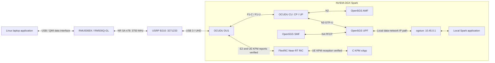

# Project Progress and System Configuration

Last updated: **2026-10-07**. The 2026-10-05 session established initial UE application traffic. The 2026-10-07 session installed FlexRIC and verified E2 Setup, actual UE KPM reports and subscription/deletion on the existing UHD DU. Cold-start/new-laptop data reproduction and synchronized traffic characterization remain pending.

## Current verified single-link architecture



The tested application path is **laptop ↔ Spark over private 5G**. Management Wi-Fi (observed Spark address `10.20.44.26` on `wlP9s9`) is separate. Public Internet connectivity, NAT and a replacement laptop default route are outside this baseline. FlexRIC receives actual UE telemetry from DU1; the two-path FR1/FR3, AI and MPTCP design remains in the [README target architecture](../README.md#target-architecture).

## Phase status

| Phase | Scope | Status on 2026-10-07 |
|---|---|---|
| 0 | DGX Spark baseline | Verified |
| 1 | UHD / B210 #1 / USB 3 | Verified |
| 2 | OCUDU build | Verified |
| 3 | Single CU/DU / N2 / F1 / Open5GS | Verified |
| 4 | RM500Q SA registration, authentication, IPv4 PDU, WWAN, local data | Verified in initial session |
| 5 | Second DU / second radio / second UE | Future work |
| 6 | Host realtime work | Performance script and privileged launch applied; sustained stability open |
| 7–8 | FlexRIC / KPM xApp | Installed; E2 Setup, actual UE reports, repaired timestamp display, subscription and deletion verified |
| 9–11 | MPTCP / RIC-assisted control / AI steering | Future work |

Next, correlate KPM with synchronized application traffic, reproduce the single-link result after a cold start and on the new laptop, characterize traffic and freeze Baseline v1 before adding the second path or active steering.

## Platform and prior build evidence

| Component | Record |
|---|---|
| Host | `spark-7c40`, NVIDIA DGX Spark / GB10, aarch64, Ubuntu 24.04.5 LTS |
| Kernel | `7.0.0-1019-nvidia`, PREEMPT_DYNAMIC |
| CPU / memory | 20 cores, one NUMA node, 121 GiB RAM |
| CPU layout | Cortex-A725: 0–4, 10–14; Cortex-X925: 5–9, 15–19 |
| OCUDU | `release_26_04`, `050a2bb`, 26.04.0, `/home/nyu/ocudu` |
| FlexRIC | `br-flexric`, `736508123fe4b5dc3db83fb5baf5f0a8e9b04fe8`, `/home/nyu/flexric`, build directory `build-ocudu` |
| FlexRIC build | GCC 13.3, Debug; `E2AP_V3`, `KPM_V3_00`, `NONE_XAPP`, multilanguage OFF |
| Build | Clang 18.1.3; system GCC 13.3 unchanged |
| Open5GS | Ubuntu arm64 packages `2.8.0~noble5` |
| MongoDB | Docker `mongo:7.0-jammy`, container `open5gs-mongo`, volume `open5gs-mongo-data` |
| UHD / B210 | UHD 4.6.0.0, serial `3271233`, name MyB210, type b200, USB 3 / 5000M |
| UE | Quectel RMU500EK / RM500QGL_VH, firmware `RM500QGLABR13A03M4G`, USB `2c7c:0800` |

CU `build/apps/cu/ocu` and DU `build/apps/du_split_8/odu` exist. Monolithic `gnb_split_8` was built for a smoke check and is not the deployment topology. Earlier `band_helper_test` passed. The earlier 30.72 MS/s, 20-second RX USB benchmark had no drops, overruns, sequence errors or timeouts; it was not an NR throughput test. Current NR sample rate is 23.04 MS/s.

The NVIDIA kernel supports `CONFIG_MPTCP=y`, `CONFIG_MPTCP_IPV6=y` and `net.mptcp.enabled=1`; no MPTCP endpoints or steering are part of this single-link result. FlexRIC and the C xApp were built with GCC 13.3. Python/CUDA AI work remains pending.

## Configuration records

The executable configuration files are in `/home/nyu/ocudu/configs`, outside this documentation repository. The base excerpts below record the 2026-10-05 traffic baseline; the gain difference observed on 2026-10-07 and the current E2 overlay are recorded separately. Editing this document does not deploy configuration.

### DU1: `configs/du1_b210_n78_20mhz.yml`

```yaml
gnb_du_id: 1

f1ap:
  addrs: 127.0.10.1
  bind_addrs: 127.0.10.2

f1u:
  socket:
    - bind_addr: 127.0.10.2

ru_sdr:
  device_driver: uhd
  device_args: type=b200,serial=3271233,num_recv_frames=64,num_send_frames=64
  srate: 23.04
  clock: internal
  clock_ppm: 0.0
  freq_offset: 0
  tx_gain: 80
  rx_gain: 40

cell_cfg:
  dl_arfcn: 650000
  band: 78
  channel_bandwidth_MHz: 20
  common_scs: 30
  plmn: "00101"
  tac: 7
  pci: 1

log:
  filename: /tmp/du.log
  all_level: info
```

TX gain 80 / RX gain 40 is the verified 2026-10-05 traffic baseline; early gain 10/20 experiments are historical. The actual base file inspected on 2026-10-07 has **TX 70 / RX 40**; the E2 overlay changes neither gain. This session validated RAN/E2 startup, subscription and actual UE KPM reception at the current settings, without a new synchronized application throughput benchmark. Preserve the actual file and record its gain for each experiment rather than silently restoring 80. Gain is not calibrated transmit power. PRACH and PUSCH CRC OK with 20–33 dB SINR established RX 40 in the earlier session. MAC/F1 captures remain disabled and no explicit `otw_format` is present.

| Radio parameter | Value |
|---|---|
| Carrier band / ARFCN / frequency | n78 / 650000 / 3750 MHz |
| SSB ARFCN / frequency | 649632 / 3744.48 MHz |
| Channel / common and SSB SCS | 20 MHz / 30 kHz |
| CRBs / subcarriers | 51 / 612 |
| FFT length from sample rate/SCS | 23.04 MS/s ÷ 30 kHz = 768 |
| SSB offset Point A / k_SSB | 0 / 4 |
| PCI / antennas | 1 / 1T1R |

The modem cell lock uses **SSB ARFCN 649632**, not carrier ARFCN 650000. DU startup reports both values. Stopping DU ends NR transmission; PSS/SSS/PBCH/SSB and system information can be transmitted without an attached UE.

### CU: `configs/cu.yml`

```yaml
cu_cp:
  amf:
    addrs: 127.0.0.5
    bind_addrs: 127.0.0.1
    supported_tracking_areas:
      - tac: 7
        plmn_list:
          - plmn: "00101"
            tai_slice_support_list:
              - sst: 1
  f1ap:
    bind_addrs: 127.0.10.1

cu_up:
  ngu:
    socket:
      - bind_addr: 127.0.0.1
  f1u:
    socket:
      - bind_addr: 127.0.10.1

log:
  filename: /tmp/cu.log
  all_level: info

pcap:
  ngap_enable: false
  ngap_filename: /tmp/cu_ngap.pcap
```

The inspected local CU file explicitly contains `ngu`. The supplied successful excerpt omitted it; runtime inspection showed N3 bound to `127.0.0.1:2152`. No isolated evidence established that adding `ngu` was necessary to fix the session. Preserve the working file and diagnose from the actual sockets.

### DU1 E2 and KPM configuration

The tested overlay is `/home/nyu/ocudu/configs/du1_flexric.yml`, loaded after the existing UHD base file:

```yaml
e2:
  enable_du_e2: true
  addrs: [127.0.0.1]
  bind_addrs: [127.0.0.1]
  port: 36421
  e2sm_kpm_enabled: true

metrics:
  layers:
    enable_sched: true
    enable_rlc: true
  periodicity:
    du_report_period: 1000
```

The existing OCUDU binary already contains E2 support; `ENABLE_EXPORT` controls library export/install and is not an E2 enable switch. No OCUDU rebuild or ZeroMQ change was needed. CU E2 and E2SM-RC control are not enabled by this overlay.

| FlexRIC setting | Current value |
|---|---|
| RIC executable | `/usr/local/bin/flexric/ric/nearRT-RIC` |
| C xApp executable | `/usr/local/bin/flexric/xApp/c/xapp_oran_moni` |
| RIC / xApp configs | `/usr/local/etc/flexric/ric.conf`, `xapp_oran_sm.conf` |
| Service model directory | `/usr/local/lib/flexric/` |
| RIC E2 / xApp E42 | `127.0.0.1:36421` / `127.0.0.1:36422`, SCTP |
| E2 identity reported by RIC | PLMN `001/01`, node ID `411`, type `ngran_gNB_DU`, DU ID `1` |
| KPM function / action / period | RAN function ID `2`, Format 4, 1000 ms |
| DU measurement names | `DRB.RlcSduDelayDl`, `DRB.UEThpDl`, `DRB.UEThpUl`, `RRU.PrbTotDl`, `RRU.PrbTotUl` |

The default xApp config also lists monolithic gNB/CU and RC subscriptions; the RAN-type checks select only the DU KPM block for this node. The `73650812` example runs for about 10 seconds, deletes its subscription and exits normally. An initial actual gNB-DU UE F1AP ID `14` run received all five metrics: selected UL/DL throughput samples were 14163–14675 / 242–253 kbps, DL RLC delay 15.80–17.30 in 0.1 ms units, and UL/DL PRB usage 86%/0%.

After the installed [timestamp repair](troubleshooting/2026-10-07_flexric_latency_fix.md), UE F1AP ID `2` produced 12 `report_age_us` values of **499–717 microseconds**, followed by normal deletion and exit. Its selected UL/DL throughput samples were 11916–11927 / 147–164 kbps, DL RLC delay **1.380–1.440 ms** after conversion, and UL/DL PRB usage **88%/0%**. UE IDs can change. Live timestamp display is now verified; precise age accuracy and synchronized application throughput are not established by these excerpts. See [runtime steps](full_reproduction_runbook.md#9a-prepare-the-du-e2-overlay) and the [dated record](troubleshooting/2026-10-07_flexric_bringup.md) for metric interpretation.

### Open5GS identity, sessions and interfaces

| Configuration | Required baseline |
|---|---|
| `/etc/open5gs/nrf.yaml` | `nrf.serving` MCC `001`, MNC `01` |
| `/etc/open5gs/amf.yaml` | N2 bind `127.0.0.5`; GUAMI/TAI/PLMN `001/01`, TAC 7, SST 1 |
| `/etc/open5gs/smf.yaml` | PFCP `127.0.0.4` → UPF `127.0.0.7`; UE pool `10.45.0.0/16`; MTU 1400 |
| `/etc/open5gs/upf.yaml` | PFCP/GTP-U bind `127.0.0.7`; IPv4 subnet `10.45.0.0/16`, gateway `10.45.0.1` |
| Existing Spark TUN | `ogstun`, `10.45.0.1/16`, MTU 1400 |
| Subscriber | Test IMSI `001010000000001`, SST 1, DNN `internet`, session type **1** |
| Laptop active bearer | IPv4/static; query current address/prefix/MTU and interface |

SMF/UPF files retain IPv6 pool entries, but the experiment uses IPv4 only. The local SMF lacks an explicit enabled `info` DNN block; the successful `internet` session was established through the subscriber/selection configuration. Do not label the lack of that block as a confirmed DNN failure.

| Function category | Units |
|---|---|
| Required/tested local SA | `open5gs-nrfd`, `open5gs-scpd`, `open5gs-udrd`, `open5gs-udmd`, `open5gs-ausfd`, `open5gs-pcfd`, `open5gs-nssfd`, `open5gs-upfd`, `open5gs-smfd`, `open5gs-amfd` |
| Legacy LTE EPC | `open5gs-mmed`, `open5gs-hssd`, `open5gs-pcrfd`, `open5gs-sgwcd`, `open5gs-sgwud` |
| Optional for this experiment | `open5gs-bsfd`, `open5gs-seppd` |
| Administration only | `open5gs-webui` |

MongoDB is separate from systemd Open5GS services, maps localhost `27017` and retains its Docker volume. Native MongoDB 8 failed with the recorded NVIDIA kernel; keep it disabled.

The inspected persistent TUN setup is `/etc/systemd/network/99-open5gs.netdev` (`ogstun`, `Kind=tun`) and `99-open5gs.network` (IPv4/IPv6 addresses/routes, MTU 1400). The UPF unit requests `systemd-networkd`. These files describe reboot recovery; a new cold reboot was not executed during the documentation update.

### Socket layout

| Interface | Local endpoints |
|---|---|
| N2 / SCTP | CU `127.0.0.1` ↔ AMF `127.0.0.5:38412` |
| F1-C / SCTP | DU `127.0.10.2` ↔ CU `127.0.10.1:38472` |
| F1-U / GTP-U | DU `127.0.10.2:2152` ↔ CU `127.0.10.1:2152` |
| N3 / GTP-U | CU `127.0.0.1:2152` ↔ UPF `127.0.0.7:2152` |
| N4 / PFCP | SMF `127.0.0.4:8805` ↔ UPF `127.0.0.7:8805` |
| E2 / SCTP | DU `127.0.0.1:<ephemeral>` ↔ FlexRIC `127.0.0.1:36421` |
| E42 / SCTP | C xApp ↔ FlexRIC `127.0.0.1:36422` |
| Local application IP | Spark `10.45.0.1` ↔ currently allocated UE `10.45.0.x` |

An SMF GTP-U listener can also exist at `127.0.0.4:2152`; it is distinct from the four recorded user-plane endpoints.

## Successful session and resolved issues

Verified in the reported session: USB 3/UHD; CU/DU startup; N2/F1-C and F1-U/N3 sockets; private n78 SSB scan; PRACH/RAR; PUSCH CRC OK and strong SINR; NR5G-only / SA-only / private cell lock; SA registration/authentication; attached packet service; subscriber/DNN; IPv4 PDU/IP allocation; connected bearer; manual WWAN configuration; private application traffic.

The active bearer example was `wwan0`, `10.45.0.2/30`, gateway `10.45.0.1`, MTU 1400. Modem/bearer IDs, QMI/AT port numbers and UE IP can change and must be queried. An EPS initial bearer display of `ipv4v6` is not evidence about the active IPv4 PDU bearer.

The first 10-second TCP uplink reported sender 7.50 MBytes / 6.29 Mbit/s / Retr 0, receiver 6.50 MBytes / 5.09 Mbit/s, instantaneous approximately 3.1–9.4 Mbit/s. This proves functional user traffic, not optimized throughput or sustained stability. The independent reverse ping, TCP downlink, UDP, and video procedures remain acceptance work.

Confirmed repairs: NRF `999/70` → `001/01`; missing subscriber provisioned; private SA cell selection/lock; subscriber type 3 → 1 after IPv4v6 rejection; host performance improvements; actual static WWAN settings applied. See the [chronological troubleshooting record](troubleshooting/2026-10-05_sa_bringup.md) for evidence and ruled-out hypotheses.

The **2026-10-07 FlexRIC session** verified all ten SA services active, CU N2 connected, DU F1 connected, E2 Setup accepted and KPM function ID 2 registered. After the codec update, the xApp completed subscription and deletion. A subsequent run received repeated actual gNB-DU UE ID `14` reports containing all five metrics and exited with `Test xApp run SUCCESSFULLY`. Traffic direction, application rate and duration were not recorded alongside these KPM excerpts, so they do not replace the 2026-10-05 application benchmark. Separate offline tests with synthetic messages checked new FlexRIC Format 4 subscriptions against the existing OCUDU decoder and OCUDU Format 3 indications against the new FlexRIC decoder.

A later installed-monitor run verified the repaired timestamp display with actual UE ID `2`, 12 report-age values of 499–717 microseconds, all five measurement names and normal subscription deletion/exit. Application sender/receiver results and precise report cadence remain unrecorded for this run.

## Host performance and remaining work

`ocudu_performance` was applied with Y/Y/Y: 20 CPU governors set to performance, DRM KMS polling disabled, four network-buffer settings set to 33554432. CU/DU run with sudo in the reproduction procedure. A sampled post-tuning check saw underflow 0, late 1. The script's network-buffer settings target Ethernet USRPs; the B210 improvement was not isolated to that setting.

Kernel replacement, PREEMPT_RT, boot parameters, CPU isolation, IRQ pinning and hugepage changes were not part of this repair. Earlier privilege warnings alone were non-blocking; recurring RF realtime failures required host tuning. Check runtime settings after reboot and monitor sustained error growth.

Next sequence: synchronized KPM/application traffic correlation → cold-start/new-laptop reproduction → 30–60-second uplink → downlink → UDP 2/4/6/8/10 Mbit/s and jitter/loss → video/latency/QoE → freeze Single-Link Baseline v1 → second independent path → independent path verification → MPTCP → AI predictor/steering → blockage/QoE experiments.

Follow the [Full Reproduction Runbook](full_reproduction_runbook.md), or its [Spark](spark_quick_commands.md) and [UE laptop](ue_laptop_quick_commands.md) command summaries. Shutdown order is traffic/xApp → PDU → laptop WWAN → DU → FlexRIC → CU → 5GC → optional MongoDB. Check runtime state before operation; keep SIM secrets and raw INFO logs out of Git.
