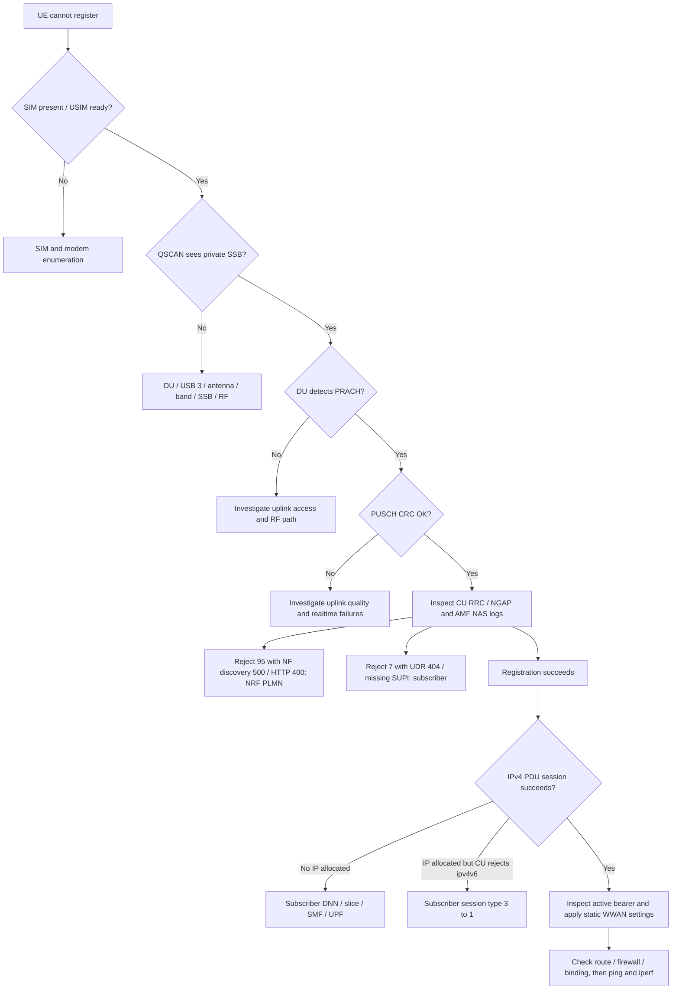

# 5G SA Bring-up Debug Record: 2026-10-05

This record preserves the operator's reported sequence from failed acquisition/registration to a working single-link 5G SA IPv4 user plane. Values below are sanitized observations, not a fresh automated reproduction. Configuration paths and the OCUDU IPv4v6 validator were inspected during the documentation update. Use the [full runbook](../full_reproduction_runbook.md) for startup and shutdown, and [project progress](../project_progress_and_configuration.md) for current settings.

## Diagnose the first failing layer



Reject numbers and CallFailed are clues, not universal root-cause mappings. Confirm the accompanying log evidence. Once private SSB, PRACH, and PUSCH CRC OK with strong SINR are established, investigate the higher layers before changing RF gain.

| Symptom | Layer / observed cause | Action supported by the record |
|---|---|---|
| `not-registered-searching`, detached, no radio interfaces | Initial state; cause not yet isolated | Check SIM, QSCAN/QENG and DU access logs |
| Public LTE/NR camp or forbidden `311/480` | UE selection drift | Apply firmware-specific NR5G-only, SA-only and private SSB lock |
| Private QSCAN result but registration fails | Acquisition works; next layer uncertain | PRACH/PUSCH → CU → AMF/NF discovery/subscriber |
| Reject 95, NRF discovery 500 and AMF HTTP 400 | NRF serving PLMN `999/70` vs test `001/01` | Correct NRF serving PLMN, restart affected 5GC and verify discovery |
| Reject 7, missing IMSI/SUPI, UDR/UDM 404 | Subscriber absent | Provision the exact SIM subscriber with known credentials |
| QNWLOCK ERROR 902 / invalid initial state | Lock attempted in an inappropriate modem state | Configure NR/SA first, then retry the SSB lock |
| QMI CallFailed after registration, SMF IP allocation and CU `Unsupported ... ipv4v6` | Subscriber type 3 caused a rejected dual-stack PDU request | Use session type 1 and `ip-type=ipv4` |
| Automatic `ims` DNN warning | Unsubscribed optional IMS request | Track the `internet` PDU result separately; IMS not required |
| Bearer connected, WWAN down/no IP | Static host settings not applied | Apply the actual bearer IPv4/prefix/MTU and private host route |
| Recurring RF underflow/late | Host realtime performance | Recorded OCUDU performance script plus privileged RAN launch; monitor error growth |
| `--list-bearers`: no actions specified | CLI version does not support that form | Inspect modem bearer paths and query `mmcli -b` |
| Repeated USB disconnect | Cable/power/port/autosuspend/modem state not isolated | Rediscover ports; investigate repeated events before deeper protocol changes |
| IP assigned but ping/iperf fails | Host path / service / filter / possible transport failure | Check local route, WWAN/ogstun, firewall, service binding and F1-U/N3 |

## Chronological evidence and fixes

### 1. Initial QMI state and SIM check

The modem initially reported `not-registered-searching`, CS/PS detached, selected network unknown and radio interfaces none. This single snapshot could not identify an RF, SIM, selection, or core cause.

The test SIM was active, IMSI `001010000000001`, operator ID `00101`, operator label OpenAirInterface, and preferred networks `00101 (lte, 5gnr)`. QMI card status was present/USIM ready. A historical `mmcli -i 0` was used on that laptop; SIM indexes must be rediscovered on another laptop.

### 2. Public-network camp and firmware command differences

Commercial scans found FirstNet, AT&T, T-Mobile and Verizon. QENG at one point showed limited-service LTE on `311/480`; C5GREG `0,2` meant searching. Public NR receive observations in earlier setup verified modem receive functionality but not private access.

Old `AT+QCFG="nwscanmode"` and `AT+QCFG="band"` returned ERROR on `RM500QGLABR13A03M4G`. This firmware used `QNWPREFCFG` mode, NSA bands, SA bands and disable-mode queries. Initial values included AUTO, NSA bands `41:77:78:79`, SA band `78`, disable mode `0`.

### 3. Spectrum and private SSB acquisition

DU on/off changed the spectrum near 3.75 GHz. That established an RF signal at the expected location; it did not prove registration, a calibrated output power, or an optimized radio link.

`[RM500Q AT]` The decisive scan command was:

```text
AT+QSCAN=3
```

Commercial NR ARFCNs included 636096, 647328, 653952 and 658080. The private result was:

```text
+QSCAN: "NR5G",001,01,649632,1,-80,-11,51,1
```

This established the private PLMN, valid SSB/PBCH acquisition, correct SSB ARFCN and PCI, and RM500Q private n78 reception. Carrier ARFCN 650000 is distinct from SSB ARFCN 649632 used by QNWLOCK.

### 4. Uplink access established

DU observations included PRACH detected, RAR transmitted, PUSCH received with CRC OK, UE Create and F1 UE context creation. PUSCH SINR was approximately 20–33 dB. These observations demonstrated that RX gain 40 was sufficient for this experiment; low B210 RX gain was not the confirmed cause of registration failure.

Successful access followed by UEContextReleaseCommand / UE Delete directed diagnosis to CU/RRC/NGAP/NAS/core. Basic F1-C and uplink access were functioning.

### 5. Registration failure: NRF PLMN mismatch

AMF received Registration Request/SUCI for the test PLMN, then reported:

```text
NRF NF-Discover failed [500]
AMF HTTP response error [400]
Registration reject [95]
UE Context Release
```

NRF `/etc/open5gs/nrf.yaml` still served MCC 999/MNC 70; SIM, DU and AMF used `001/01`. The corrected block was:

```yaml
nrf:
  serving:
    - plmn_id:
        mcc: 001
        mnc: 01
```

After restart, UDR registration to NRF and AUSF→UDM, UDM→UDR, SMF→AMF and AMF→SMF discovery succeeded. Inspect NRF as well as AMF when aligning PLMN.

### 6. Registration failure: subscriber absent

Later logs changed to `Cannot find IMSI in DB`, `Cannot find SUPI in DB`, UDR/UDM HTTP 404, AUSF missing SUPI, AMF missing SUCI and Registration Reject 7. A query found no subscriber for the test IMSI. Provisioning the matching subscriber repaired this distinct failure. Authentication secrets are intentionally excluded from this record.

`AT+CIMI` confirmed the IMSI. QCCID and EF_ICCID via CRSM returned all FF. The ICCID behavior did not prevent the eventual successful authentication; standard AT commands do not reveal Ki/OPc, and IMSI alone cannot determine them.

### 7. Stable NR SA selection and cell lock

`[RM500Q AT]` The recorded working sequence was:

```text
AT+QNWPREFCFG="mode_pref",NR5G
AT+QNWPREFCFG="nr5g_disable_mode",2
AT+QNWLOCK="common/5g",1,649632,30,78
```

For this firmware/setup, value 2 disabled NSA. Attempts in the wrong initial state returned CME ERROR 902 / invalid nwlock initial state. Mode and lock could reset after physical/CFUN reboot and needed rechecking.

### 8. Registration and authentication succeeded

QENG showed `NOCONN`, NR5G-SA, TDD, `001/01`, PCI 1, TAC 7, SSB ARFCN 649632 and n78. C5GREG returned `0,1`. ModemManager reported registered, 5gnr, operator `00101` / Test PLMN 1-1, home registration, packet service attached. `NOCONN` meant idle/camped and was compatible with successful registration.

### 9. A separate PDU-session failure

IPv4 simple-connect initially timed out at ModemManager states register (6/10), packet service attached (7/10), bearer (8/10), connect (9/10). QMI reported protocol error 14 CallFailed and verbose call-end reason `(3,1140)`, returning from connecting to registered.

Open5GS logged DNN `internet`, created UPF sessions and allocated 10.45.0.2 through 10.45.0.6 on repeated attempts. These observations ruled out a missing `internet` DNN or inability to allocate IP as the primary cause in this sequence. IP allocation alone did not prove the complete PDU/DRB setup succeeded.

### 10. PDU root cause: IPv4v6 rejected by OCUDU

Enabling CU INFO logs revealed:

```text
PDUSessionResourceSetupRequest
Unsupported PDU Session Type: ipv4v6
Validation of PDUSessionResourceSetupRequest failed
PDUSessionResourceSetupResponse
```

Open5GS reported an unsuccessful setup response with `Cause[Group:4 Cause:6]`. Subscriber session type 3 requested IPv4v6, which the current OCUDU build rejected. Changing that session to type 1 (IPv4) repaired data setup. The runbook contains a nonsecret projection and a targeted update for the existing `internet` session.

This limitation is scoped to the recorded OCUDU build. The inspected source `/home/nyu/ocudu/lib/ngap/ngap_validators/ngap_validators.cpp` explicitly rejects `pdu_session_type_t::ipv4v6`; do not generalize it to all future releases.

The modem's automatic `ims` request also produced an unsupported/unsubscribed DNN warning. It was not the cause of the `internet` bearer failure, and IMS was outside the experiment.

### 11. Independent host realtime failures

The DU separately produced recurring RF underflow and late failures. Running `sudo ./scripts/ocudu_performance`, answering Y/Y/Y, and launching DU with sudo yielded 20 performance governors, disabled DRM KMS polling and network buffers 33554432. A later sampled check recorded underflow 0 / late 1. The changes improved the sampled behavior; long-duration realtime stability and each setting's individual effect remain unmeasured. Network-buffer tuning in that script targets Ethernet radios, while B210 uses USB.

### 12. Connected IPv4 bearer and manual host setup

IPv4 simple-connect then succeeded. The active bearer reported connected yes, suspended no, multiplexed no, `wwan0`, APN `internet`, IPv4, static address `10.45.0.2`, prefix 30, gateway `10.45.0.1`, MTU 1400 and DNS 8.8.8.8/8.8.4.4. The modem's EPS initial-bearer `ipv4v6` display was not the active PDU bearer type.

The tested mmcli version rejected `--list-bearers`; querying modem bearer paths and `mmcli -b N` worked. WWAN remained DOWN without an IP until static settings were applied. Address `.2`, bearer 2, modem IDs, AT ttyUSB2 and QMI cdc-wdm2 were observations, not stable identifiers.

### 13. First functional user-plane result

An iperf3 server bound to Spark `10.45.0.1` and a laptop client bound to its actual UE address transferred TCP uplink traffic. The first default 10-second test reported:

| Metric | Observation |
|---|---|
| Sender | 7.50 MBytes, 6.29 Mbit/s, Retr 0 |
| Receiver | 6.50 MBytes, 5.09 Mbit/s |
| Instantaneous rate | Approximately 3.1–9.4 Mbit/s |

This demonstrated PDU/DRB, F1-U, N3, UPF/ogstun and application data. Throughput was not optimized. It does not establish TCP downlink, sustained UDP loss/jitter, live video performance, or long-duration stability. No public Internet NAT was required.

### 14. Shutdown discovery

Stopping the SA services alone left BSF, SEPP, EPC services and WebUI running. Full shutdown must explicitly handle those installed services. MongoDB runs separately in Docker and can be intentionally left available; persistent data is retained. Traffic and PDU teardown precede DU, then CU, then core shutdown.

## Conclusions preserved for future debugging

Confirmed issues: NRF PLMN mismatch; missing subscriber; unstable private-SA selection; rejected IPv4v6 session; host realtime failures; unapplied static WWAN settings. RX gain 40 insufficiency, inability to receive n78, invalid SSB, missing `internet` DNN, UPF allocation failure, broken basic F1-C and the IMS warning were ruled out as the primary causes by the later evidence.

The local CU file currently includes an explicit `cu_up.ngu` bind at `127.0.0.1`, whereas the supplied successful configuration excerpt omitted it. Both describe the observed N3 socket. Its necessity was not established by an isolated comparison; do not label adding `ngu` as a confirmed root-cause fix. The inspected DU also omits the old explicit `otw_format: sc12`; do not silently restore old RF settings.

Next work: cold-start reproduction, 30–60-second uplink, TCP downlink, UDP at 2/4/6/8/10 Mbit/s, RF-error counters, live video/latency/QoE, and a frozen Single-Link Baseline v1 before any second-path or control-stack extension. Keep raw INFO logs local; publish only reviewed excerpts without SIM secrets, vectors, K_gNB, K_int, K_enc, RRC or UP keys.
